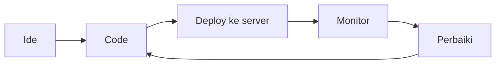

<div align="center">


<br>

<a href="https://portfoliofiqih.vercel.app"></a>
<a href="mailto:fiqihkurniadi2003@gmail.com"></a>


<br><br>


</div>


## Tentang saya

```text
fiqih27@lampung:~$ whoami
Fiqih Kurniadi, IT enthusiast dari Lampung

fiqih27@lampung:~$ cat fokus.txt
web        bangun website yang cepat, rapi, dan siap produksi
server     deploy, konfigurasi, dan jaga layanan tetap hidup
hardware   rakit, upgrade, dan bongkar masalah sampai ketemu akarnya

fiqih27@lampung:~$ cat prinsip.txt
Setiap baris code menuntun imajinasi menemukan bentuknya.
```


## Tech stack

**Web**


**Server dan tools**


**Hardware**


## Cara kerja




## Aktivitas

<div align="center">


<br>


</div>


